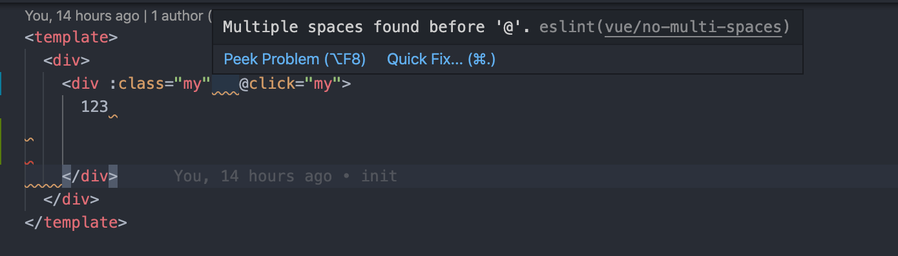

# Standardjs Spec with .vue|js|ts files

由于 [standardjs](https://standardjs.com/) 官方对 Vue 的支持不足，导致无法直接在 cli 使用 `standard --plugin vue **/*.vue` 命令来检查/修复 .vue 文件的语法错误。必须需要显示创建 .eslintrc.js 文件。  
出于该原因在这里我编写了一个 eslint 扩展。排除了网络上的错误的，过时的，复杂的答案。保证你使用最简单的方式在项目里集成 standard 规范。

## 为什么要选择 standard 

如果你是非 vue 项目，react|js|ts 均可完美与 standard 结合。只需安装一个依赖即可实现 lint 功能

- 无须配置。 史上最便捷的统一代码风格的方式，轻松拥有。
- 自动代码格式化。 只需运行 standard --fix 从此和脏乱差的代码说再见。
- 提前发现风格及程序问题。 减少代码审查过程中反反复复的修改过程，节约时间。

## How to use standard in vue project

如何与 vue 项目结合使用，一个具体的 [example](./example/.eslintrc.js) 实现可以查看当前项目的 example 配置

### 安装依赖

只需安装一个依赖即可

```bash
$ npm i eslint-config-standard-vue-ts --save-dev
```

### 创建 .eslintrc.js

```js
module.exports = {
  extends: [
    'standard-vue-ts'
  ],
  // 如果你还需要检测 ts 文件则添加该项，并且保证根目录有 tsconfig.json 文件
  parserOptions: {
    project: './tsconfig.json'
  }
}

```

### 添加脚本命令

```json
"lint": "eslint ./ --ext .js,.vue,.ts",
"lint:fix": "eslint ./ --ext .js,.vue,.ts --fix"
```

## VSCode formatOnSave

开启 VSCode 保存自动格式化能力

### 安装 plugin

安装下载量最高的 eslint plugin，这里注意如果你还在使用 `eslint.formatOnSave` 说明你当前用的是旧的 eslint 插件


### vscode setting

必须包含以下配置

```js
{
  "editor.codeActionsOnSave": {
    // 保存自动格式化
    "source.fixAll.eslint": true
  },
  "eslint.validate": [
    "javascript",
    "javascriptreact",
    {
      "language": "vue",
      "autoFix": true
    }
  ],
  "files.associations": {
    "*.vue": "vue"
  }
}
```

### 成功提示

如果你成功的进行了配置，那么你将会在 VSCode 中看到错误提示，如果没看到则意味着你的配置并没有成功



## Readme

这里着重介绍 standardjs 规范与大部分人的传统习惯可能不太一致的地方

- 不写分号，这没有什么不好。懂得什么情况下不写分号会导致错误(这种情况你应该一辈子也碰不上)比你永远加分号要好得多 ref: [JavaScript 语句后应该加分号么？](https://www.zhihu.com/question/20298345/answer/49551142)
- 使用驼峰命名禁止使用下划线这会拉长你的词距, 不得不承认的是 JS 世界更加 like 驼峰
- 使用单引号
- 不再有冗余的变量 – 这是导致 大量 bug 的源头!
- 关键字后加空格 if (condition) { ... }
- 函数名后加空格 function name (arg) { ... }
- 坚持使用全等 === 摒弃 == 一但在需要检查 null || undefined 时可以使用 obj == null。
- 一定要处理 Node.js 中错误回调传递进来的 err 参数。
- 使用浏览器全局变量时加上 window 前缀 – document 和 navigator 除外
- 避免无意中使用到了这些命名看上去很普通的全局变量， open, length, event 还有 name。
- [查看更多](https://standardjs.com/rules-zhcn.html#javascript-standard-style) – 为何不试试 standard 规范呢！

## Feature

- 只需创建一个文件，安装一个依赖即可，抛弃繁琐的配置文件依赖
- 无需安装 tslint (事实上tslint 已经接近废弃，功能已经以插件的形式被 eslint 全部包含) ref: [那些你应该考虑卸载的 VSCode 扩展](https://zhuanlan.zhihu.com/p/125773296)
- 针对所有类型的文件使用同一套规范
- 最简单的 eslint 配置
- 允许 vue 组件每多个属性在一行 （这块 vue 与 standard 官方的态度相反，vue 建议每个属性换行，standard 禁止。相信我不要让每一个 props 都换行，这会导致你一个非常简单的组件都会超过100行并且这看起来一点也不优雅。只有超过某个数量(这里设置为8个)才换行。这里并没有找到有什么配置能够在 eslint fix 的时候去掉多属性换行改为合在一行，如果你发现了如何实现欢迎来提交 PR

## FAQ

常见问题收录

### 如何在大型项目中使用该规范

大部分的老项目都不存在 lint 工具或者是旧的 lint 工具无法满足需求，在多人开发的场景下，如果某人使用了新的 lint 工具来进行了一些 fix 操作，通常都会导致 merge 的时候出现一堆冲突。  
这里提出个人认为比较好的迁移方案。

#### 单独创建 style/standard 分支

```bash
$ git checkout -b style/standard
```

在该分支上加入本项目的依赖配置以及脚本文件。但是此时不要做 fix 操作来修复业务代码！  
将分支 push 到 origin

#### 同步分支

各个不同业务分支的同学同步 style/standard 的更新内容。
并且各自在本地执行 `npm run lint:fix` 将能够自动修复的部分修复，像下划线转驼峰这些需要手动修复的错误可以先忽略

#### style/standard 分支修复

在 style/standard 分支执行 `npm run lint:fix` 将能够自动修复的部分修复，像下划线转驼峰这些需要手动修复的错误可以先忽略
这样我们的 style/standard 分支 以及各个业务分支都已经自动修复了 code style

#### style/standard merge 业务分支

通过 pr 来让style/standard 去merge 业务分支，由于各个分支都自动跑了一遍 fix 所以这时候不存在语法层面的冲突可以直接merge

#### style/standard 修复其他错误

style/standard merge 完业务分支后，在该分支上修复剩余的所有错误。例如下划线转驼峰这些需要手动修复的错误

#### style/standard 合入 master

这时候就可以安心的把 style/standard 合入 master 了，如果此时还存在没有合入 master 的业务分支，可以直接 pull style/standard 的最新修改即可以自动修复下划线转驼峰这些需要手动修复的错误。之后新的需求直接从 master 切新的分支开发即可

### 这个规范与我的习惯差距很大怎么办

不要拘泥于你的习惯一成不变，虽然一些语法没有优劣之分，但不得不承认的是大部分的语法以今天的发展眼光看来都是设计的非常落后的。follow 这套最先进的规范，无论对你还是对团队都是提升。就像 PHP 的大部分语法设计都是被人诟病的。大部分模版引擎的语法设计也十分的反人类极其的落后难用。

### 如果我不同意某条规则，可以改吗？
不行。制定这套 standard 规范的目的就是让大家都不必再花时间浪费在无谓的代码风格之争上面了。关于缩进该用制表符还是空格这个问题已经争论了很久了，永远也没有答案。争论这个都可以把需求提前写完了。遵循 standard 规范，你就不用再犹豫了，毕竟不管怎样争论总归会选择一种风格的。希望大家也能在个人语义和普适价值上做一个权衡。

如果你非要自己去配置成百上千项的 ESLint 规则，那你可以直接使用 eslint-config-standard 来将个人配置包装在上层。

小贴士：选择 standard 然后保持吧。把时间留下来解决其他有意义的问题！(^____^)/

### 毕竟这不是一份正式的 Web 规范啊！

确实！这份规范不隶属于任何官方组织，所以才叫 standard/standard 而不是 ECMA/standard 嘛。

而 standard (标准) 一词在这里不局限于 “web 标准” :-) 。 举个例子：

这个模块帮助我们将代码维持在一个高的水准（standard of quality）
这个模块确定项目中的新手遵循一些基本的样式规范（style standards）
